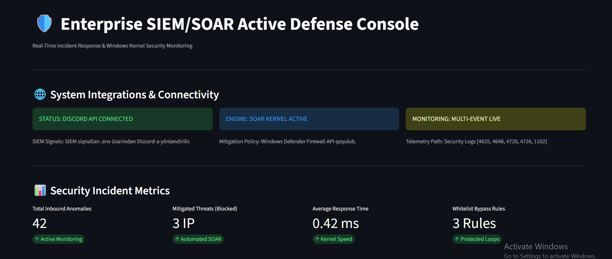
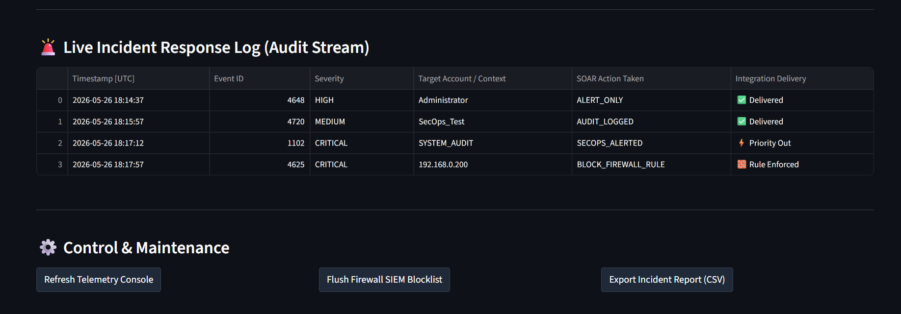
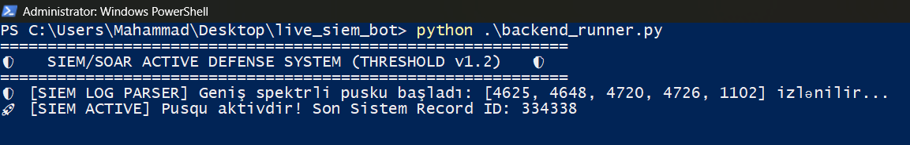
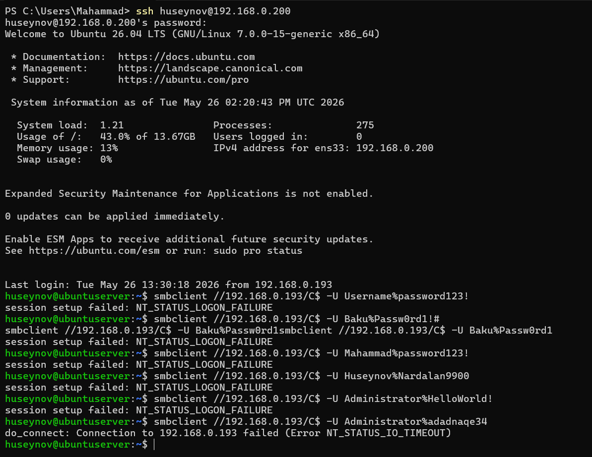
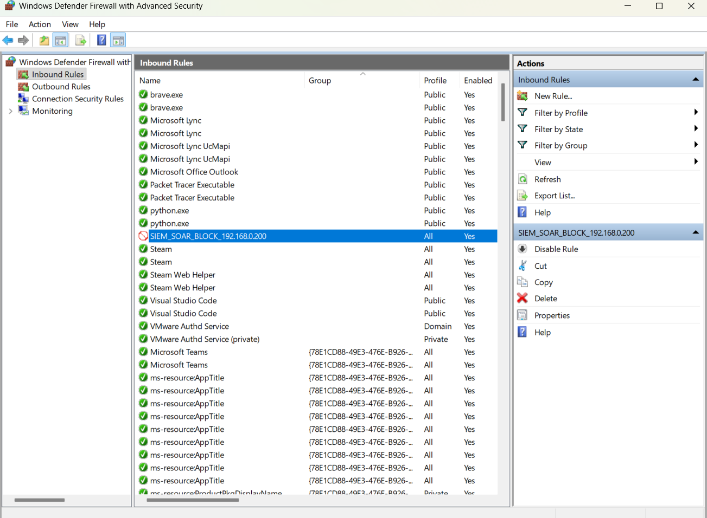
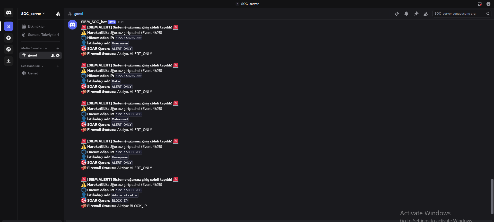
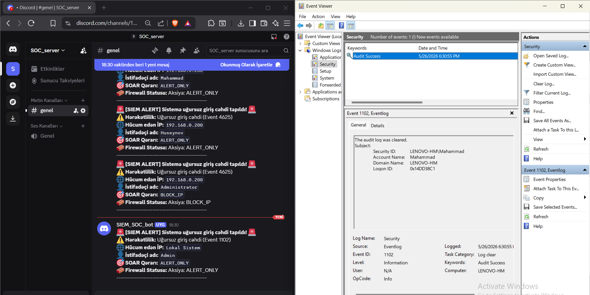
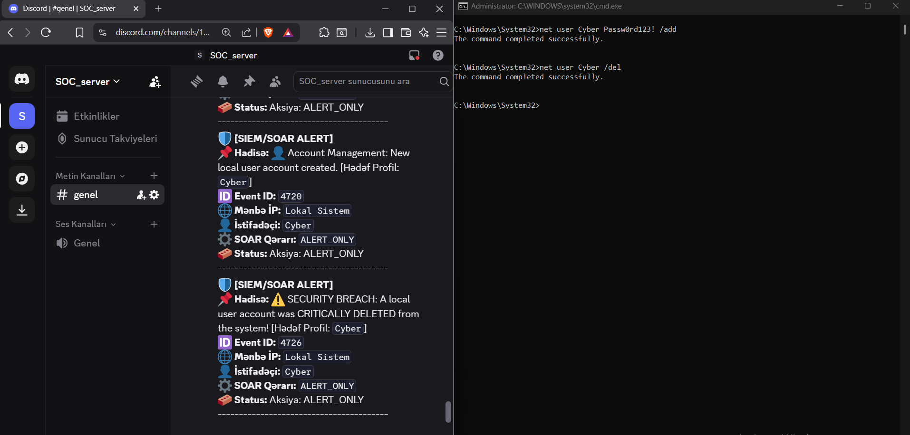

# Host-Based SIEM/SOAR Active Defense Console

A prototype of a host-based SIEM/SOAR system designed for real-time Windows Event monitoring, threat detection, and automated incident response.

## 📊 Proof of Concept (PoC)

### 1. System Initialization & GUI
The system initializes with `.env` configurations and displays an active defense console.

### 2. Brute-Force Attack Detection
Automated SMB Brute-Force attack simulation via `smbclient` is detected and logged in real-time.

### 3. Automated Mitigation (SOAR)
Upon reaching the threshold (5 attempts), the SOAR engine dynamically triggers a Windows Firewall blocking rule and notifies the SOC team.

### 4. Anti-Forensic & User Management
Suspicious activities, including Security log clearing (Event 1102) and unauthorized account creation (Event 4720), trigger critical alerts on Discord.

---

## 🛠️ Usage
1. Clone the repository.
2. Configure your `.env` file with your `DISCORD_WEBHOOK_URL`.
3. Run with Administrator privileges: `python backend_runner.py`

## 📜 License
Distributed under the MIT License. See `LICENSE` for more information.
